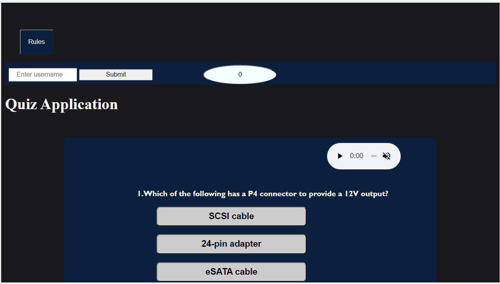
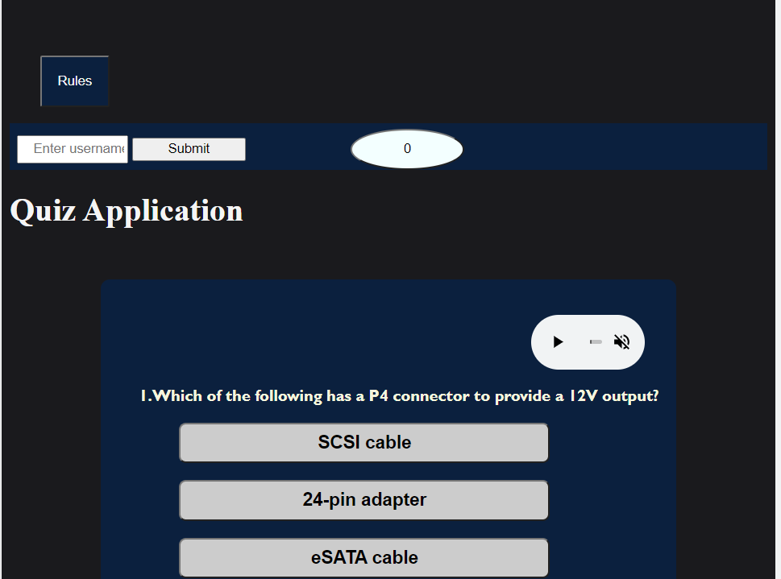
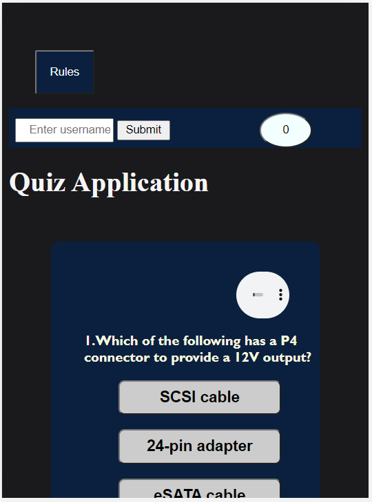
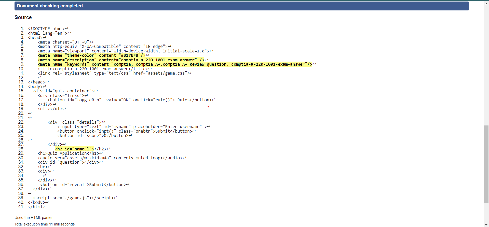
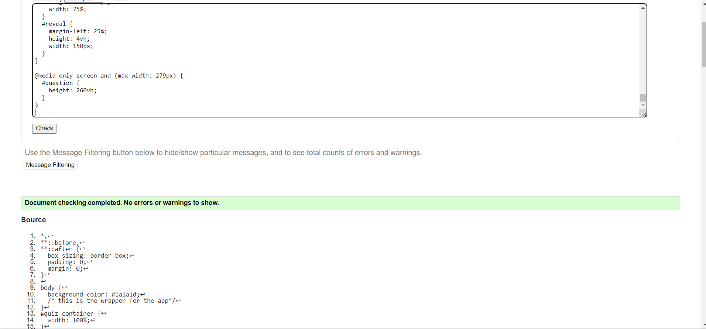
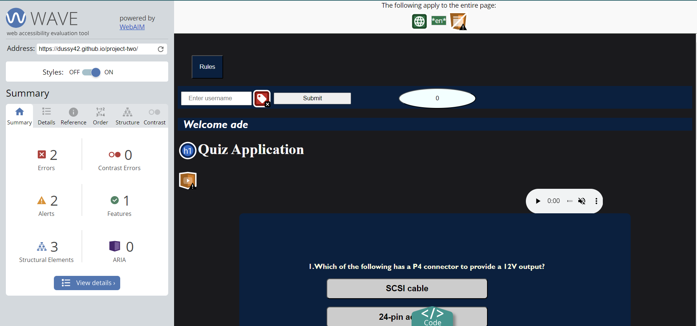

# project-two
The [comptia A](https://dussy42.github.io/project-two/) quiz was based on real comptia a+ exam questions and i particularly choose this because of my past experience in preparing for the comptia exam. However, potential user will have a feel of what real exam situation feels like, more like an exam simulation practise.

# User Experience (UX)
Key information for the site
this section provides insight into the UX process, focusing on who the website is for, the main aims of the project and how the website can help users meet their needs.
[wireframe](/documentation/wireframe.png)

# Project goals: 

To encourage people to take the quiz and prepare them for the comptia A+ exam(real exam simulation). 
To provide users with immediate feedback(upon clicking any option in any question, the background colors changes to red if its red and green if the answer is right) .  

In addition, to this is the submit button(below the question page )   which allows the user to finish the game and get score evalauation on the scoreboard screen beside the username submit button at the top.

## 1 FEATURES  
1 Navigation  
 The Rules button is vivid at the top left corner (this contains the rules\guidelines for the guiz).

## 2 CONTENTS  
1. To begin with are the form fields which enables the user to enter username and submit respectively. In addition is score field whichmakes the user keeps track of performance interms of right and wrong answers and also an audio to spice the quiz.

2. In addition to the foregoing are the questions and options well laid out in warm contrasting colors. Also included is the submit button below the question page which aids the user to submit quiz and get a score on the scoreboard at the top of the page.

## DEPLOYMENT
The following were steps involved in the deployment  
In GitHub, navigate to the repository and click Settings  
Within Settings, navigate to the Source section within the Github Pages section.  
From the dropdown menu, select master branch and then click Save. 
Now, all of  repositories can be found with a link generated here at [comptia A](https://dussy42.github.io/project-two/). 
## CREDITS  
All the codes were mine , though the idea to create the review quiz was gotten from tutorial videos online. 

** VALIDATOR TESTING**:  
[W3C](https://validator.w3.org/nu/#textarea) was used to validate the html while [jigsaw](https://validator.w3.org/nu/#textarea) was used for css , jshint for javascript and both turn out to be no error.While [wavereport](https://wave.webaim.org/report#/https://dussy42.github.io/project-two/) was also used to validate for errors and mostly color. I affrirm  upon using lighthouse in devtools that the website is accessibile with legible fonts and well lighted colors

 
 

 
