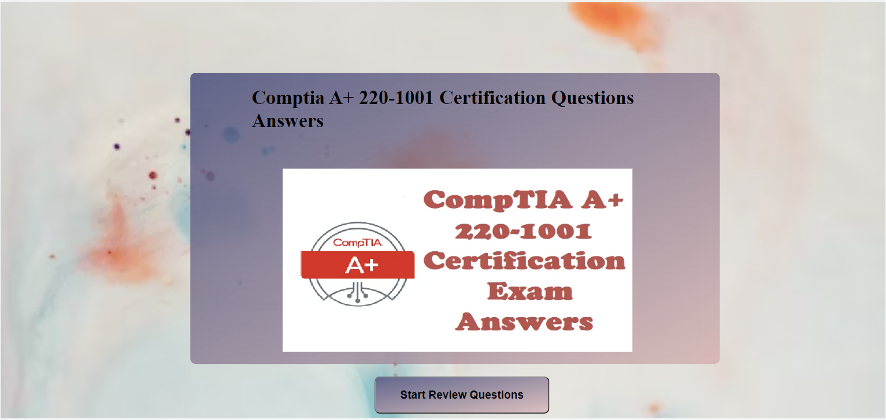
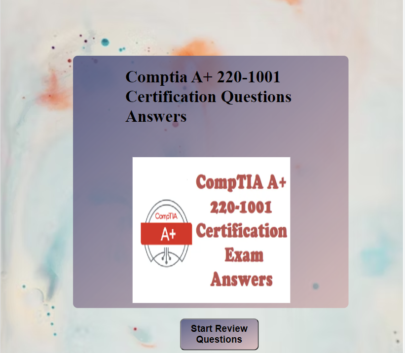
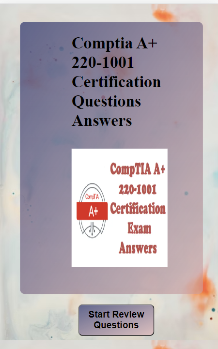
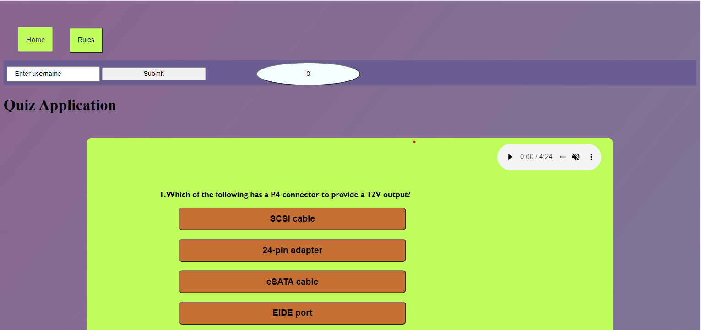
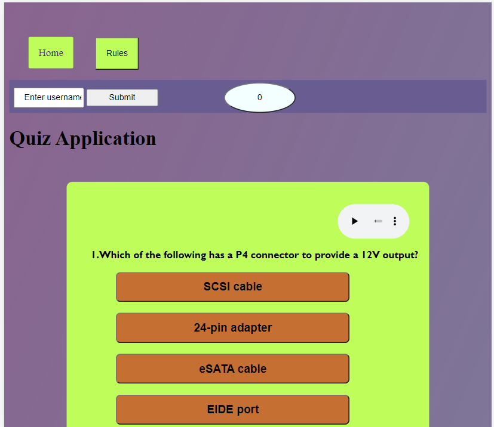
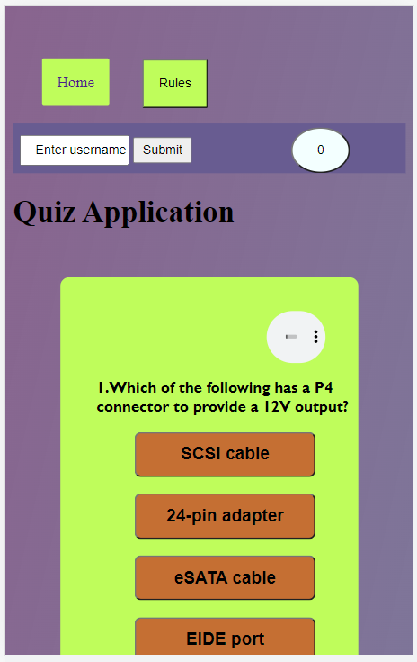

# project-two
The comptia a+ review quiz is based on real comptia a+ exam questions and i particularly choose this because of my past experience in preparing for the comptia exam. However, potential user will have a feel of what real exam situation feels like, more like an exam simulation practise.

# User Experience (UX)
Key information for the site
this section provides insight into the UX process, focusing on who the website is for, the main aims of the project and how the website can help users meet their needs.

# Project goals: 

To encourage people to take the quiz for them to prepare for the comptia A+ exam(real exam simulation). 
To provide users with immediate feedback(upon clicking any option in any question, the background colors changes to red if the option clicked is wrong and blue if the answer is right) .  

In addition, to this is the reveal button below left hand corner which alows the user to finish the game and get score evalauation on the scoreboard screen beside the submit button at the top.

## 1 FEATURES  
1 Navigation  
Upon clicking start review button on the Home Page which eventually opens the quiz itself. Therefore, to the top left is the Home button and Rules button(this contains the rules\guidelines for the guiz).

## 2 CONTENTS  
1. To begin with are the form fields which enables the user to enter username and submit respectively. In addition is score field whichmakes the user keeps track of performance interms of right and wrong answers and also an audio to spice the quiz.

2. In addition to the foregoing are the questions with options well laid out in warm colorcontrasting colors. Also included are the reveal buttons below each questions which aids the user to know the right answers. Though a feature was included in the javascript to reveal the right answer option amongst the four choices of every question.

## CREDITS  
All the codes were mine , though the idea to create the review quiz was gotten from tutorial videos online. However, the background images were sourced from [Unsplash](https://unsplash.com/s/photos/full-screen-wallpaper) and [servicecentrelist](https://servicecentrelist.com/comptia-a-220-1001-certification-questions-answers)

** VALIDATOR TESTING**:  
W3C was used to validate my html while jigsaw was used for css and also jshint for javascript and both turn out to be no error.Be that as it may, i affrirm  upon using lighthouse in devtools that the website is accessibile with legible fonts and well lighted colors

 
  
 
